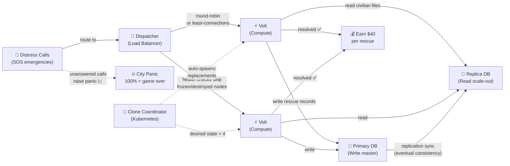
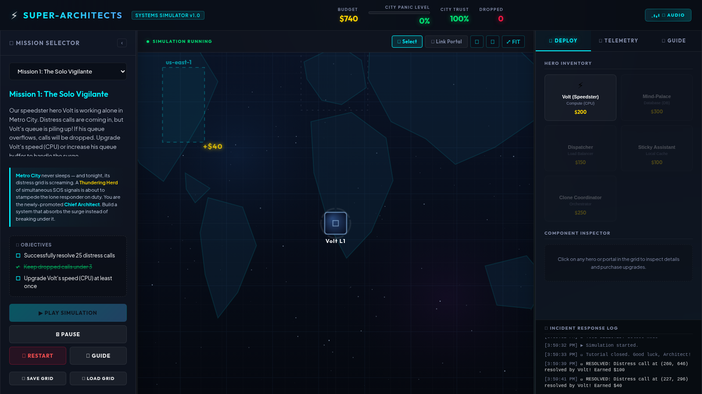
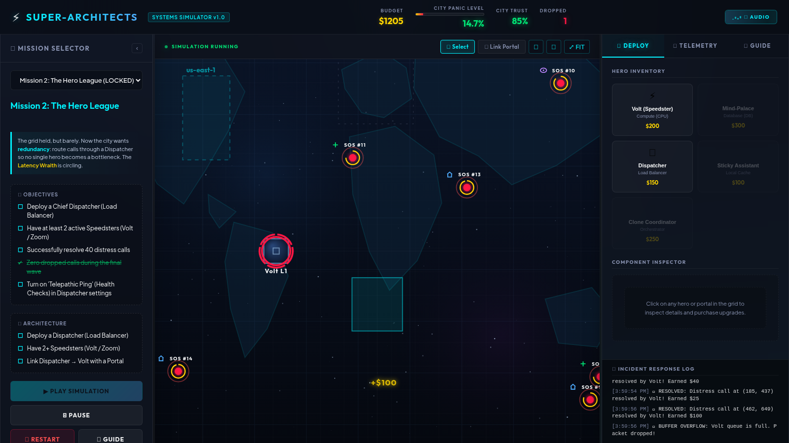
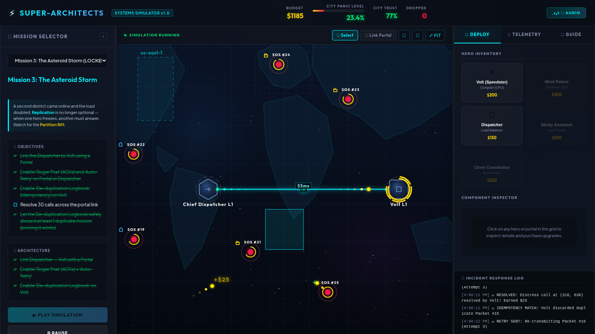
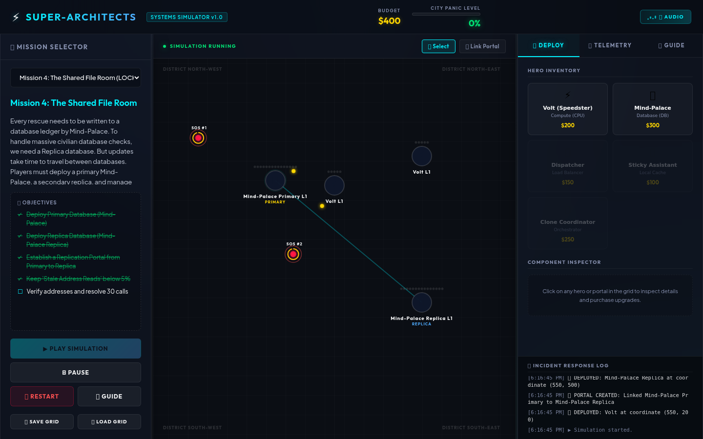
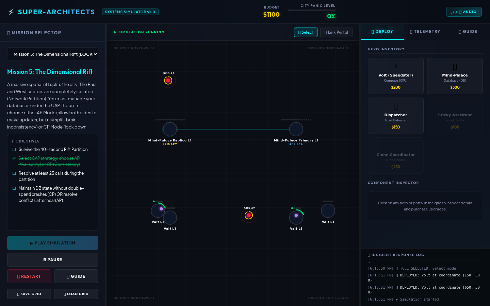
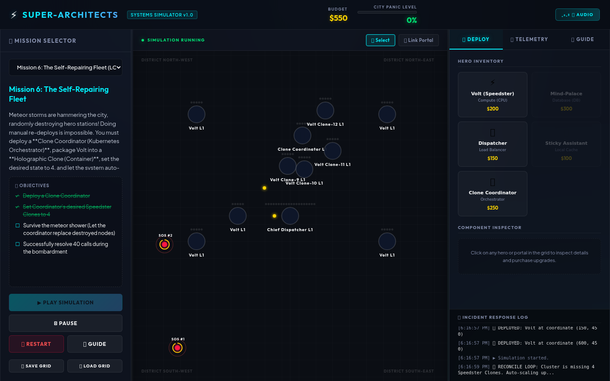
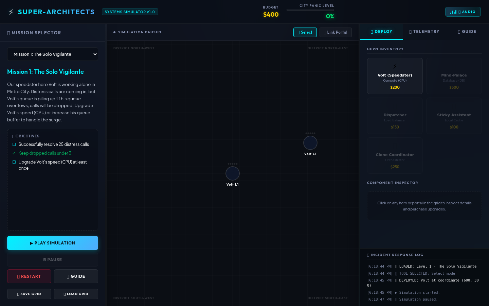
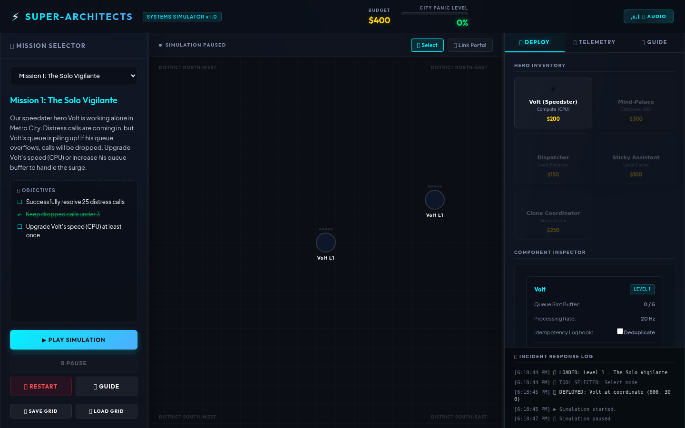
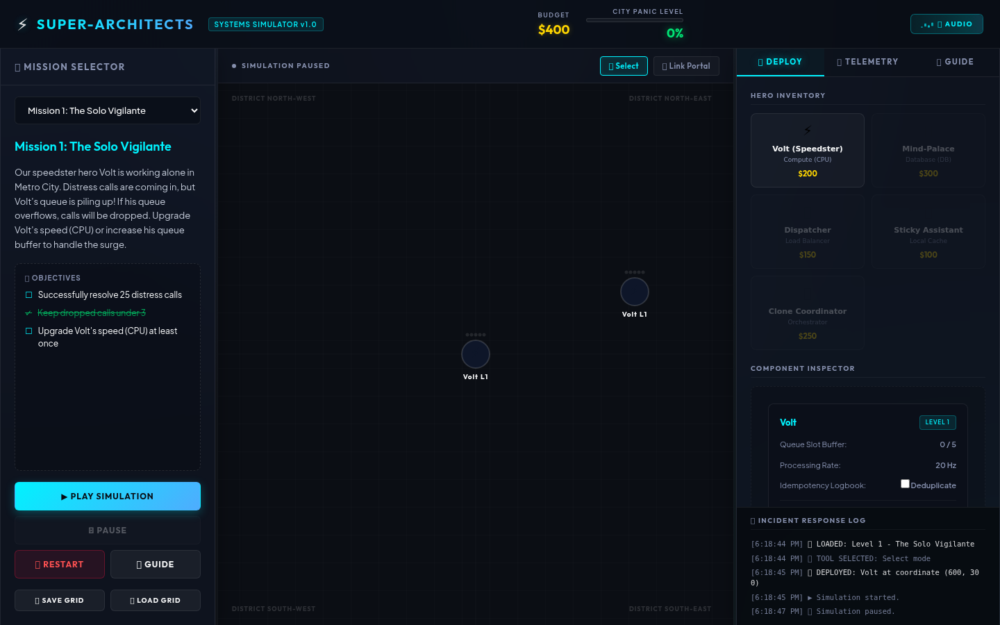

# ⚡ Super-Architects: Distributed Systems Learning Game

> "In the AI era, code is generated in seconds. The real engineering challenge is no longer writing lines of code, but architecting resilient, scalable networks of systems that coordinate compute, storage, databases, and communication."

**Super-Architects** is an interactive, visual, zero-dependency learning game designed to prepare kids and students for this new architectural era. By translating abstract computing systems into concrete **superhero characters with physical abilities and constraints**, the game builds an intuitive, visual model of distributed systems design.

---

## 🌌 The Vision & Premise

Distributed computing is notoriously difficult to teach. Traditional education relies on complex jargon (e.g. *load balancers, Docker containers, multi-AZ active-passive replication, idempotency keys*).

**Super-Architects removes the jargon and replaces it with physical constraints:**
*   A hero who runs fast can only solve one problem at a time before getting tired (**Compute/CPU limits**).
*   A filing room can only hold so many documents before running out of drawers (**Storage/Disk limits**).
*   A psychic portal connecting two bases has a specific width and can drop messages in a storm (**Network Latency & Packet Loss**).
*   A clone can be popped into existence instantly, do a job, and vanish, but requires a coordinator to summon more when they get hit (**Containers & Kubernetes**).

By interacting with these hero agents, players learn the **fundamental trade-offs** of systems architecture: speed vs. storage, consistency vs. availability, local processing speed vs. communication delays.

---

## 🦸‍♂️ The System Metaphors (Hero Roster)

| Superhero | Computing Equivalent | Role in the City |
| :--- | :--- | :--- |
| **Volt (Speedster) ⚡** | **Compute (CPU / RAM)** | Runs around the city to resolve SOS distress calls (requests). Handles tasks one-by-one. Can get overloaded (CPU 100%). |
| **Mind-Palace 🧠** | **Database (SQL/NoSQL)** | Memorizes civilian file registries. Operates in Primary (writes) or Replica (reads) roles. |
| **Dispatcher 📡** | **Load Balancer** | Listens to incoming police scanner calls and telepathically routes them to available speedsters (Volt/Zoom). |
| **Sticky Assistant 📌** | **Cache Memory** | A helper who memorizes the answers to frequent questions, preventing Volt from wasting time walking to the database. |
| **Holographic Clones 🤖** | **Containers (Docker / Pods)** | Standardized, temporary energy constructs of Volt that run on the city's power grid, solve one task, and disappear. |
| **Clone Coordinator 🐳** | **Orchestrator (Kubernetes)** | A manager that automatically summons replacements when clones are destroyed by meteor strikes. |
| **Warp Portals 🌀** | **Network Links** | Portals connecting hero bases. Can drop messages in asteroid storms (packet loss) or divide the city (network partition). |

---

## 🌐 How It Works

*Players build this infrastructure from scratch across 6 progressive missions.*

---

## 🎮 The 6 Missions (Level Progression)

### Mission 1: The Solo Vigilante — *Single Node Limits*

Volt is working alone. As SOS calls surge, his queue overflows and panic rises. Players learn to upgrade his speed (CPU) and queue buffer (vertical scaling), realizing it has a physical limit.

### Mission 2: The Hero League — *Load Balancing*

Volt gets frozen in ice by a villain. Players deploy a second Speedster and a Dispatcher. They must configure **Telepathic Ping (Health Checks)** so the Dispatcher bypasses frozen heroes.

### Mission 3: The Asteroid Storm — *Network Loss & ACKs*

Portals drop 35% of packages. Players must configure **"Roger That" signals (ACKs)**, **Auto-Retries**, and Volt's **De-duplication Logbook (Idempotency)** to prevent duplicate rescue attempts.

### Mission 4: The Shared File Room — *Replication Lag*

Every rescue needs to be written to a database ledger. Volt writes to the Primary but queries civilian addresses from the Replica. Replication lag causes stale reads — players manage sync speed to keep consistency.

### Mission 5: The Dimensional Rift — *CAP Theorem*

A spatial rift cuts the city in two. In **AP Mode** players accept updates in both halves and resolve conflicts after heal. In **CP Mode** databases in the minority partition lock down writes.

### Mission 6: The Self-Repairing Fleet — *Kubernetes*

Meteor showers randomly smash speedsters. Players deploy a Clone Coordinator, set a desired state of 4 clones, and watch the system automatically self-heal when nodes are destroyed.

---

## 🕹️ Operational Guide (How to Play)

1.  **Select a Tool**: Use the top-center controls to toggle between **Select** (to inspect nodes) and **Link Portal** (to connect two towers).
2.  **Deploy Heroes**: Select the **🛠️ DEPLOY** tab in the operations console on the right, click a hero card, and click on the map grid to place them. A **crosshair cursor** confirms you are in placement mode.

    

3.  **Establish Connections**: Select **Link Portal**, click on the source node (e.g. Dispatcher), and click the destination node (e.g. Volt).
4.  **Inspect & Upgrade**: Select **Select**, click on any deployed tower on the map, and purchase upgrades (e.g., speed boosts, queue size increases) or toggle properties (AP/CP strategy, health checks) in the Inspector.

    

5.  **Sound On!** 🔊 Use the audio button in the header to toggle procedural synthwave music and SFX generated by the Web Audio API.
6.  **💾 Save & 📂 Load Grid**: Use the control buttons in the left panel to persistently save your hero layouts, credits, and metrics, and restore them later.

---

## 🚀 How to Run (Zero Dependencies)

Super-Architects has **no build steps or npm installations**. It runs entirely locally in your web browser.

### Method A: Direct Browser File (Offline)
1.  Locate the folder on your computer.
2.  Double-click or drag `index.html` directly into any web browser.
3.  *Note: Because the scripts are refactored to bypass local file CORS restrictions, the game works instantly offline without a local server.*

### Method B: Single-Line Local HTTP Server
If you prefer to host it locally to test with web standards, run any of the following commands in the project directory:

*   **Python 3**: `python3 -m http.server 8000` (Open `http://localhost:8000`)
*   **Node.js**: `npx -y serve` (Open the displayed localhost URL)

---

## 🛠️ Codebase Architecture

For engineers or curious students who want to look under the hood, the game is written in modular, decoupled Vanilla JavaScript:

| File | Size | Purpose |
| :--- | :--- | :--- |
| **`index.html`** | 295 lines | Semantic layout and control panels |
| **`style.css`** | 1100 lines | CSS Grid / Flexbox layout, glassmorphic HUD, deploy card states |
| **`js/levels.js`** | 243 lines | Level configurations, story briefs, objective rules, custom tick triggers |
| **`js/simulation.js`** | 1140 lines | Tick-rate physics engine: queues, packet routing, DB sync, CAP merge, cloning |
| **`js/renderer.js`** | 341 lines | Canvas vector drawing: animated packets, laser links, meteor shockwaves |
| **`js/ui.js`** | 828 lines | Tab selectors, click-to-deploy, inspector, panel resizers, tutorial wizard, save/load |
| **`js/app.js`** | 94 lines | Bootstraps the components, wires callbacks, starts the requestAnimationFrame game loop |
| **`js/audio.js`** | 578 lines | Procedural synthwave music + SFX via Web Audio API; panic-level morphs BPM and tone |

For a deeper dive into the tick engine, packet lifecycle, audio synth, and all Mermaid diagrams, see **[docs/architecture.md](docs/architecture.md)**.

---

## 📄 License

MIT © 2026 Barry-Michael van Wyk — see [LICENSE](LICENSE).