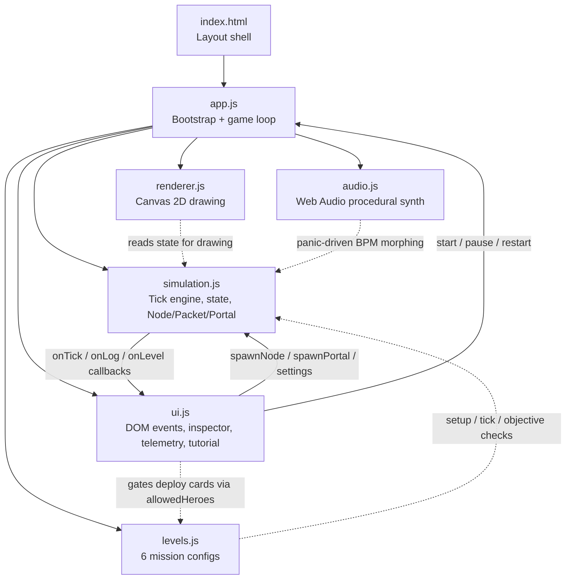
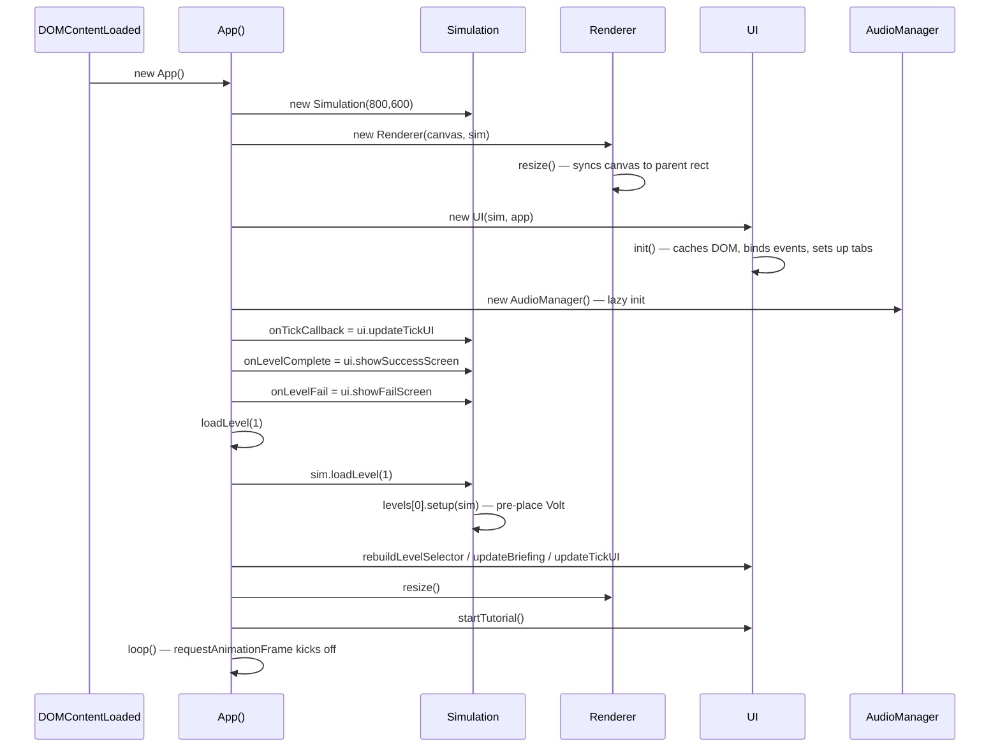
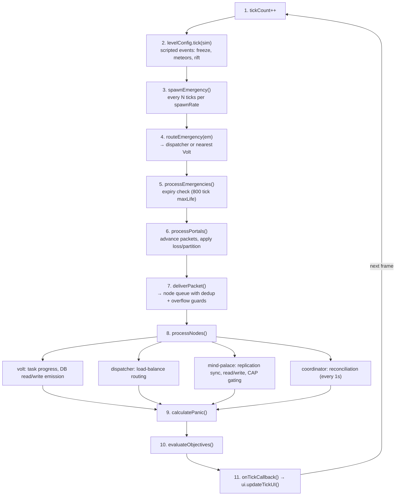
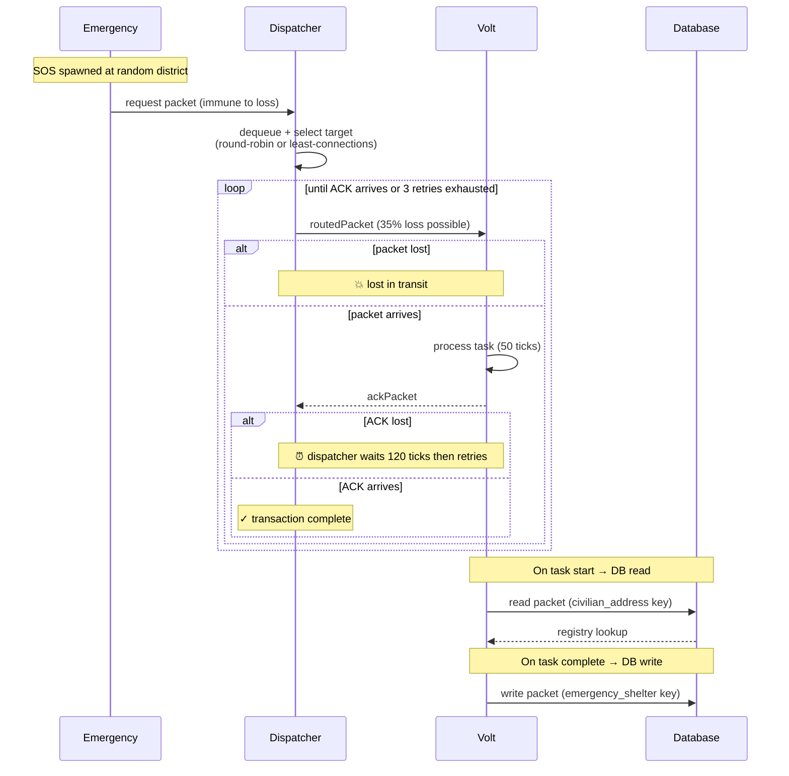
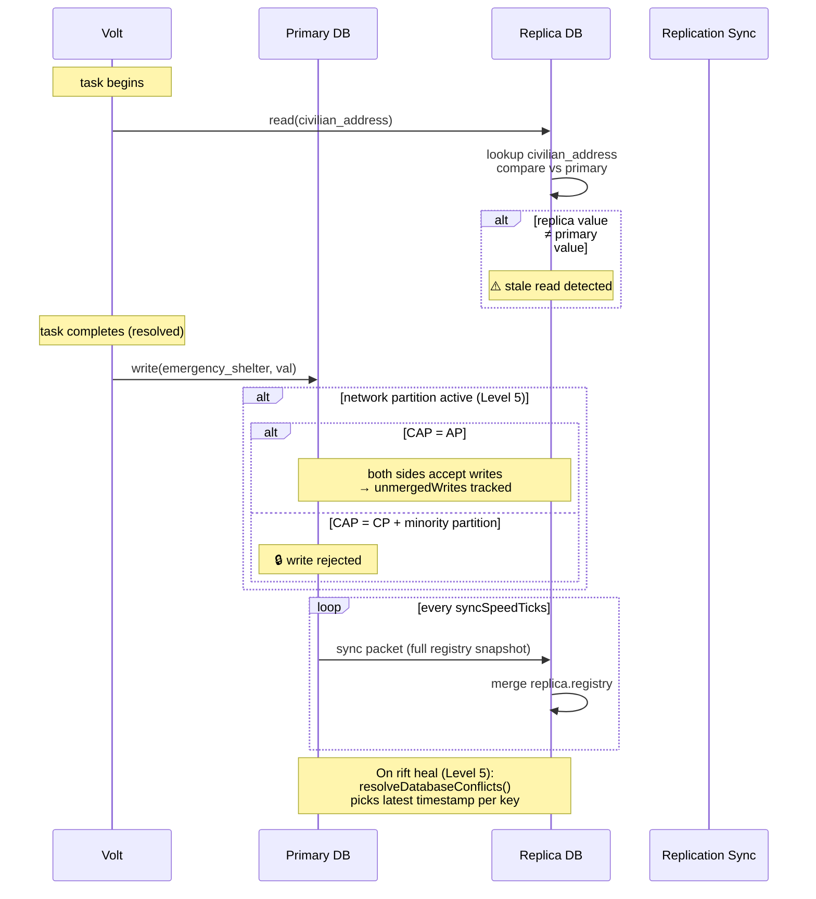
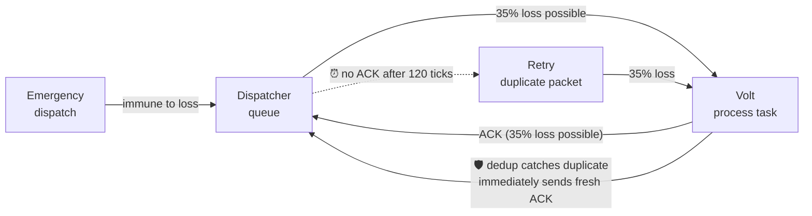
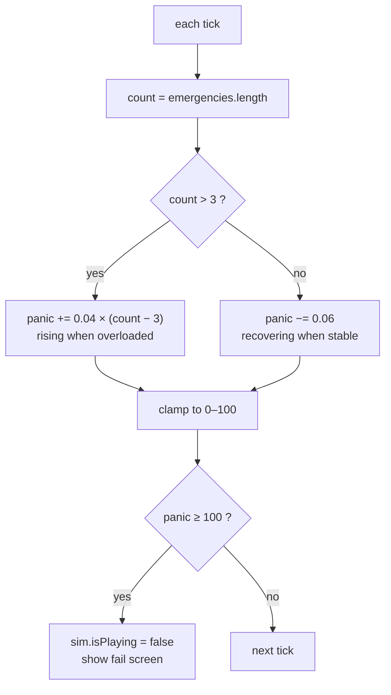
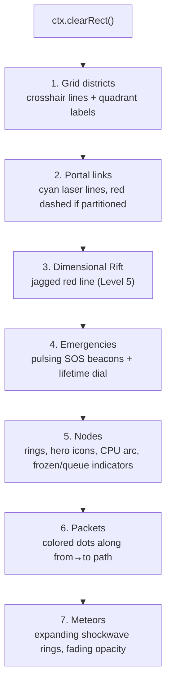
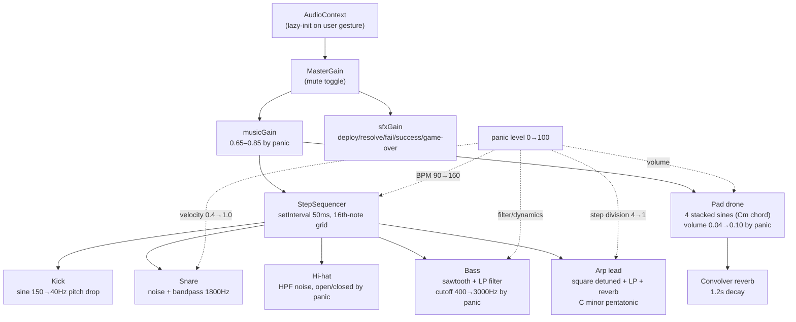
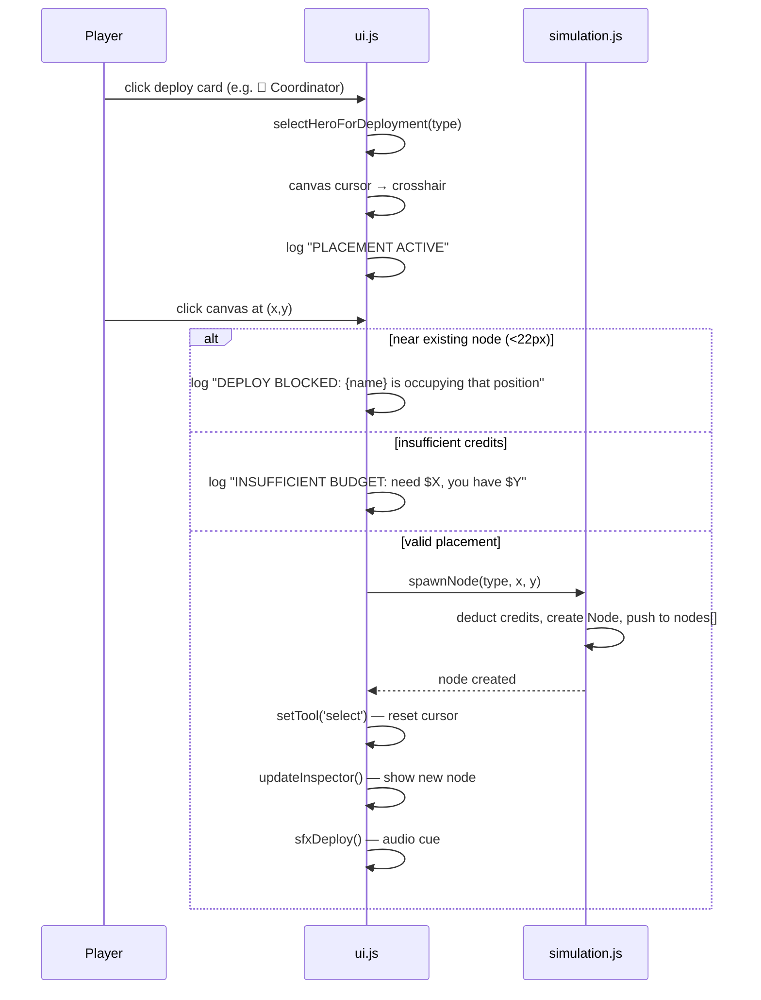

# Super-Architects — Architecture

## Overview

Super-Architects is a single-page browser game with no framework, no build pipeline, and no runtime dependencies beyond the DOM and Canvas APIs. Every script is loaded via plain `<script>` tags and communicates through a shared `window` namespace.

The game simulates a distributed system at 60 ticks per second. Emergencies (distress calls) spawn in the city, packets route between hero nodes, and the player deploys and upgrades infrastructure to resolve calls before city-wide panic reaches 100%.

---

## Component Architecture



*Solid arrows* = direct invocation. *Dotted arrows* = data flow or callback paths.

---

## File Map

```
index.html          ── Layout shell, toolbar, panels, canvas element
style.css           ── All visual styling (CSS Grid, glassmorphism, animations)
js/
  app.js            ── Bootstrap, game loop, component wiring
  simulation.js     ── Simulation engine, Node/Packet/Portal classes, tick logic
  renderer.js       ── Canvas 2D drawing: grid, nodes, packets, particle effects
  fx.js             ── Presentation-only effects (starfield bg, deployment grid, diagram nodes, orthogonal connectors, particles)
  topology.js       ── Read-only graph engine: pathing, role queries, blueprint validation (consumed by routing + UI)
  ui.js             ── DOM event binding, inspector, telemetry, tutorial, save/load
  levels.js         ── Level configuration array (6 missions)
  audio.js          ── Procedural Web Audio synth (music + SFX, panic-driven BPM)
docs/
  architecture.md   ── This file
  improvements-design.md ── Three-phase improvement plan (Phase 1 detailed)
```

---

## Startup Sequence



---

## Simulation Engine (`simulation.js`)

The simulation runs an explicit tick cycle — no delta-time accumulation, no physics stepping. Each call to `sim.tick()` advances the world by exactly one logical frame.

### Tick Cycle



### Key Classes

#### `Simulation`
The monolithic engine. Owns all state arrays (`nodes`, `packets`, `portals`, `emergencies`), the `stats` accumulator, and the `settings` object that gates ACK/retry/loss/CAP strategies.

#### `Node`
A hero tower. Key fields:
- `type`: `volt`, `mind-palace`, `dispatcher`, `cache`, `coordinator` (or `volt` + `isClone`)
- `status`: `active` | `destroyed`
- `isFrozen`: boolean (Level 2 freeze, bypassed by dispatcher health checks)
- `queue[]`: waiting packets (max `maxQueue`)
- `processingRate` (Volt): 0.02 → 50 ticks per task
- `dbRole` (Mind-Palace): `primary` | `replica`
- `registry{}` (Mind-Palace): key-value store, seeded with `emergency_shelter` and `civilian_address`
- `dedupEnabled` / `seenPacketIds`: idempotency for retry duplicate detection
- `desiredReplicaCount` (Coordinator): target clone count

#### `Packet`
A message in transit. Key fields:
- `type`: `request`, `ack`, `sync`, `write`, `read`
- `state`: `in-transit` | `sent-waiting-ack`
- `progress`: 0→1, advances by `speed` (0.025) per tick → 40 ticks to deliver
- `from`/`to`: `Node` references (or `null` for emergency-dispatch packets)
- `payload`: `Emergency` object (for requests), `{key, val}` (for DB writes), `{key}` (for DB reads), `{registry}` (for sync)

#### `Portal`
A bidirectional link between two nodes. Only rendered; the simulation doesn't enforce portal connectivity for routing — packets fly directly between nodes regardless of portal links.

---

## Packet Lifecycle



---

## Database Read/Write Flow (Levels 4–5)



### Design decisions
- **Read key `civilian_address` vs write key `emergency_shelter`**: The write key is a single hot record — every rescue mutates it. If the read targeted the same key, the replica would be stale after *every* write, making the <5% stale objective impossible. Using a stable address-book key ensures replicas are only stale during the first sync window.
- **Single shared write key**: In Level 5, both left-side and right-side Volts write to `emergency_shelter`. During a partition, each side's DB records a competing value. On heal, `resolveDatabaseConflicts()` detects the collision and picks the latest timestamp.
- **Partition-aware routing**: `findTargetDatabase()` filters by same-side when `networkPartitionActive` is true. Left-side Volts won't attempt to read from a right-side replica that's unreachable across the rift.

---

## Packet Loss & Retry Semantics (Level 3)

Network loss (35% default) applies in `processPortals()` when a packet reaches 50% progress. It only applies to **forwarded** packets (`pkt.from !== null`) — the initial dispatch from an emergency to a dispatcher is immune (no retry path exists for it).



Dedup handling: when a retry duplicate arrives at the Volt, `seenPacketIds` catches it, `stats.duplicates++`, and the Volt immediately replies with a **fresh ACK**. This ACK-echo ensures the dispatcher doesn't exhaust all 3 retries just because the first ACK was lost.

---

## Panic System



| Emergencies | Panic rate | Time to 100% from 0 |
|-------------|-----------|---------------------|
| 4 | 0.04/tick = 2.4/sec | ~42 seconds |
| 6 | 0.12/tick = 7.2/sec | ~14 seconds |
| 8 | 0.20/tick = 12.0/sec | ~8 seconds |
| 10 | 0.28/tick = 16.8/sec | ~6 seconds |

The coefficient was tuned from the original `0.12` (which caused 28%/sec at 7 emergencies) down to `0.04` to make levels recoverable after a brief surge.

---

## Canvas Rendering (`renderer.js`)

The renderer is called on every `requestAnimationFrame`, independent of simulation ticks. It draws in order:



**Packet colors:**

| Type | Color | Hex | Radius |
|------|-------|-----|--------|
| `request` | Yellow | `#ffd600` | 4px |
| `ack` | Green | `#00e676` | 3px |
| `sync` | Cyan | `#00f2fe` | 5.5px |
| `write` | Orange | `#ff9800` | 4.5px |
| `read` | Purple | `#bb86fc` | 4.5px |

---

## Audio Engine (`audio.js`)

All sound is synthesized in the browser via the Web Audio API — no external audio files. The engine lazy-initialises an `AudioContext` on the first user click (browser autoplay policy compliance).



### Panic-driven musical morphing (0→100%)

| Parameter | Calm (0%) | Frantic (100%) |
|-----------|-----------|----------------|
| BPM | 90 | 160 |
| Bass LP cutoff | 400 Hz (warm) | 3000 Hz (bright) |
| Arp division | 1 note / 4 steps | 1 note / 1 step |
| Pad volume | 0.04 | 0.10 |
| Snare velocity | 0.4 | 1.0 |

---

## Deploy UX



Card disabled states are computed in `updateDeployInventoryLimits()`:
- **Not allowed** → tooltip: "This component is not available on the current mission."
- **Can't afford** → tooltip: "Need $X — current budget: $Y"

---

## Level Configuration Format

Each level in `levels.js` is a plain object:

```js
{
  id, name, tagline, desc,
  credits: 1200,                          // starting budget
  allowedHeroes: ['volt', 'mind-palace'], // gates deploy card enabled states
  spawnRate: 1100,                        // ms between spawn cycles (÷16.6 = ticks)
  spawnIntensity: 2,                      // emergencies per spawn cycle
  objectives: [{ id, text, check(sim) }]  // evaluated every tick
  setup(sim),                             // pre-place nodes, set sim.settings
  tick(sim)                               // scripted events each tick
}
```

Objectives are evaluated in `evaluateObjectives()` every tick. When all pass, the simulation stops and `onLevelCompleteCallback` fires.

---

## Save / Load

- `sim.serialize()` → JSON string with nodes, portals, level, credits, stats, settings
- `ui.saveState()` → writes to `localStorage` key `super_architects_save_state`
- `ui.loadState()` → reads, calls `sim.deserialize(json)` which rebuilds nodes/portals via `spawnNode`/`spawnPortal`
- Level unlock progress: `localStorage` key `super_architects_unlocked_levels` (array of unlocked level IDs)

---

## Testing Strategy

The codebase has no test framework. Integration verification is done via Node.js scripts that:
1. Load `simulation.js` and `levels.js` into a `vm` sandbox (no browser required)
2. Instantiate a `Simulation`, set up a level, and run `sim.tick()` in a loop
3. Assert on objective completion and stat values

Example:
```js
const vm = require('vm');
const ctx = vm.createContext({ window: {}, console, Math, ... });
vm.runInContext(fs.readFileSync('./js/simulation.js'), ctx);
const sim = new ctx.window.Simulation(800, 600);
// ... setup, run ticks, verify objectives
```
