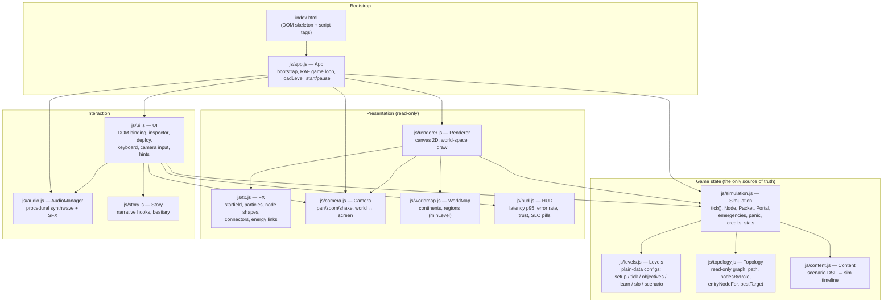
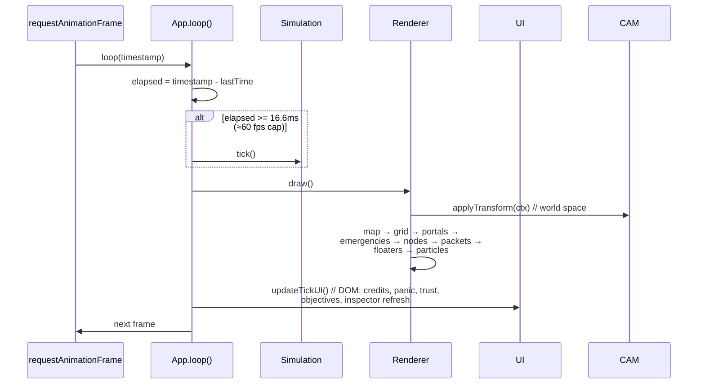
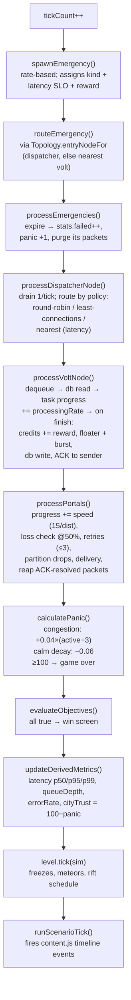
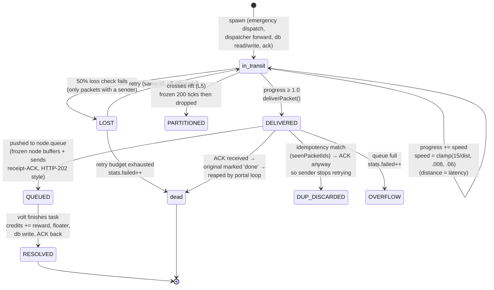
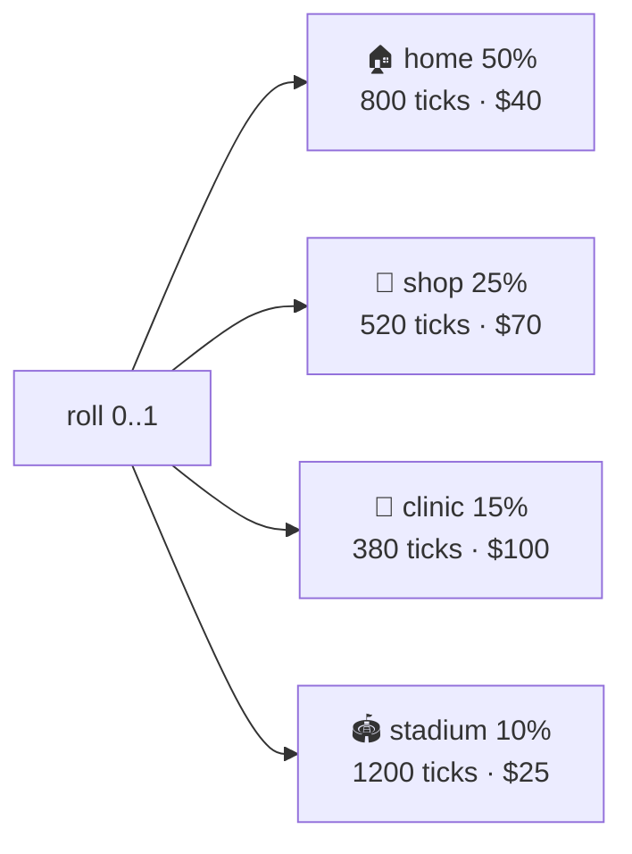
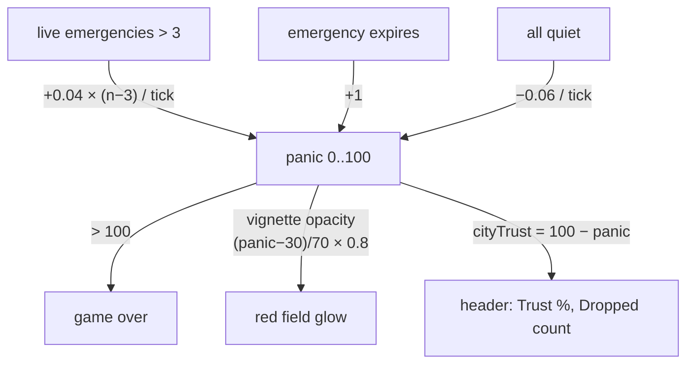
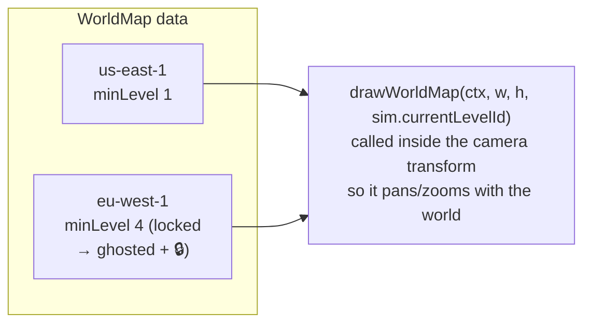
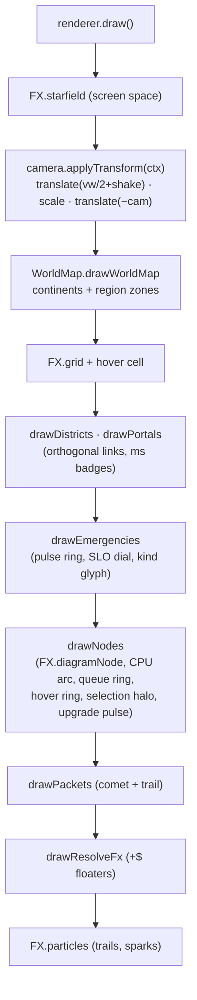

# Super-Architects — Architecture

> A living document for **humans and AI agents**. It explains how the game is put together, how the mechanics actually work, and how to modify it safely. Pair it with `AGENTS.md` (working rules) and `docs/superpowers/plans/` (change history).
>
> **The one-sentence model:** a zero-build, zero-dependency browser game where plain `<script>` tags wire independent modules together through the `window` namespace, a single `Simulation.tick()` advances all game state, and everything else (renderer, UI, audio) only *reads* that state or *requests* changes to it.

---

## 1. Module map

No bundler, no framework, no package.json. `index.html` loads every module; each attaches one class/namespace to `window`. Dependencies flow strictly downward: **App → UI/Simulation → support modules**. The renderer never mutates state; the simulation never touches the DOM.



**File responsibility contract** (enforced by `AGENTS.md` — do not cross these lines):

| File | Owns | Must never do |
|---|---|---|
| `simulation.js` | All mutable game state; `tick()` is the only way state advances | Touch DOM, canvas, or audio |
| `renderer.js` | Canvas draw calls, delegating polish to `FX` | Mutate simulation state |
| `fx.js` / `worldmap.js` | Pure presentation | Any game logic or state mutation |
| `camera.js` | View transform + `shake()` | Mutate sim state |
| `topology.js` | Read-only graph queries | Mutate sim |
| `ui.js` | DOM, input, inspector, telemetry display | Game logic / simulation rules |
| `levels.js` | Plain-data configs + `setup`/`tick`/`check` closures | New engine mechanics (those go in `content.js`/`simulation.js`) |
| `content.js` | Scenario DSL → `sim._scenarioEvents` timeline | Rendering |
| `audio.js` | Web Audio; lazy-init on first user gesture | Run before a user gesture |

---

## 2. The frame loop

Everything happens on one `requestAnimationFrame` loop. The simulation is capped to ~60 ticks/sec; drawing happens every frame for fluid visuals.



Key consequence for modifiers: **if you want something to change over time, it must happen inside `tick()`** (or in a `level.tick` closure). Anything drawn but not ticked is a frozen prop.

---

## 3. Inside `Simulation.tick()`

The tick is a fixed pipeline. Order matters (e.g. emergencies expire *before* portals move packets, so a dead call's packets are cleaned up the same tick).



---

## 4. Packet lifecycle (the heart of the game)

Packets model requests, ACKs, DB reads/writes and replication syncs. Their state machine is where most mechanics live.



**Design invariants worth memorizing** (each exists because breaking it broke a level):

- Only *forwarded* packets (those with a `from`) suffer loss — the initial emergency dispatch has no retry path and must be immune.
- A duplicate delivery **must echo an ACK**, or the sender burns all retries against a call that already succeeded.
- Frozen nodes **buffer** incoming requests and ACK receipt; they don't connection-refuse. (Refusing caused a deterministic L2 failure.)
- The portal loop iterates backwards and only accounts for *its own* splice — `deliverPacket` must never remove a second packet from the array (mark it `'done'`; the loop reaps it). This desync once crashed L6.

---

## 5. Mechanics reference

### 5.1 Latency-sensitive origins (Phase G)

Every emergency rolls a place-kind; the kind sets its **timer** (latency SLO) and **reward**. Tight SLO = high pay. This is the economic pressure behind geo-placement and the *Nearest Region* routing policy.



Packet travel time is **physical**: absolute velocity ≈ 15 px/tick, so a 600 px hop takes ~40 ticks (badge reads `80ms` at 2 ms/tick) while a cross-map crawl takes 3–4× longer. Link badges in `renderer.drawPortals` show this number on every portal.

### 5.2 Panic & trust



> ⚠️ **Balance-critical:** the 0.04 congestion coefficient gates game-over timing across all 6 missions. Re-tune only with a full `playtest.js` run (see §7).

### 5.3 Databases, replication & CAP (L4–L5)

- `mind-palace` nodes carry `dbRole: 'primary' | 'replica'`. Volts **write** the hot key `emergency_shelter` to the primary after each rescue, and **read** the stable key `civilian_address` from the nearest replica.
- Replication sync packets travel primary → replica; anything read before the first sync is a **stale read** (tracked in `stats.staleDbReads` — L4's <5% objective).
- L5 activates `settings.networkPartitionActive`: cross-rift packets freeze and drop. The player picks **AP** (both sides write; conflicts counted & resolved on heal) or **CP** (minority locks down; zero conflicts required). `settings.capStrategy` drives the checks.

### 5.4 Orchestration (L6)

`coordinator` nodes hold `desiredReplicaCount`; when meteors destroy volts, the coordinator spawns `isClone` nodes to heal back to desired state. Clones route and process like normal volts.

### 5.5 Geography & regions (Phase G)

`js/worldmap.js` holds normalized continent polygons and region zones:



Dispatcher routing policy `nearest` picks the active speedster closest to the emergency origin — the GeoDNS / latency-based-load-balancing lesson.

### 5.6 Economy

Credits: start per level (600–1600), +reward per rescue, upgrade costs `{1:150, 2:300, 3:500}` (volt: +0.015 processing, +3 queue), decommission refunds 50% of `node.cost` (preplaced nodes are free and permanent).

---

## 6. Rendering pipeline

World-space drawing is wrapped in the camera transform; the starfield deliberately stays in screen space for parallax depth.



**Click-to-world** (`ui.toWorld`) maps client px → canvas backing px via `canvas.width / rect.width` *before* `camera.screenToWorld` — this scaling is what makes selection work when CSS size ≠ backing size. Node hit radius is 28 px.

---

## 7. How to modify things (recipes)

### Add a level

Append a plain object to `window.Levels` in `js/levels.js`. No registration anywhere else.

```js
{
  id: 7, name: "...", tagline: "...", desc: "...",
  credits: 1500, allowedHeroes: ["volt", "dispatcher"],
  spawnRate: 1000, spawnIntensity: 2,
  learn: "One-sentence concept the player just mastered.",   // win-screen recap
  objectives: [ { id: "unique_id", text: "...", check: (sim) => sim.stats.resolved >= 30 } ],
  setup: (sim) => { const s = sim.snapToGrid(sim.width/2, sim.height/2);
                    sim.spawnNode('volt', s.x, s.y, { preplaced: true }); },
  tick: (sim) => {}
}
```

Rules: pre-placed nodes **must** pass `{ preplaced: true }` (otherwise credits are silently deducted), snap positions with `snapToGrid`, and keep objective `check` closures cheap (they run every tick — read `sim.stats`, don't scan the graph).

### Add a scripted incident

Do **not** hard-code events into `level.tick`. Add a `scenario` array to the level (plain data) and let `content.applyScenario` schedule it:

```js
scenario: [
  { atTick: 600, kind: 'freeze', target: 'volt', label: '❄️ Deep Freeze' },
  { atTick: 1200, kind: 'latency', factor: 0.3, label: '👻 Latency Wraith' }
]
```

New failure kinds are implemented once in `simulation.fireScenarioEvent` and become available to every level.

### Add a node type

1. `simulation.js`: extend the `Node` class defaults + any processing branch.
2. `fx.js`: give it a `shapePath` branch so `diagramNode` can draw it.
3. `ui.js`: deploy cost in `handleCanvasClick`, inspector controls in `updateInspector`, card gating via `levelConfig.allowedHeroes`.
4. `levels.js`: add it to `allowedHeroes` where relevant.

### Add a routing policy

One branch in `processDispatcherNode` (see `nearest` for the pattern) + one `<option>` in the `sel-routing` dropdown in `ui.updateInspector`.

### Tune balance

Central knobs: the kind/SLO table in `spawnEmergency`, panic constants in `calculatePanic`, upgrade costs in `Node.upgrade`, reward in the volt resolve path. **After any balance change, run the full winnability harness** — several "harmless" tweaks in this repo's history broke L2 or L6 deterministically.

### Verify like the CI would

There is no test framework; verification is two harnesses:

```bash
# 1. Syntax + winnability (headless vm, all 6 levels)
node --check js/<file>.js
node /tmp/opencode/playtest.js          # expect: ALL WINNABLE

# 2. Real-browser smoke (Puppeteer is in node_modules)
NODE_PATH=$PWD/node_modules node -e "/* load page, startSimulation, assert DOM/state */"
```

The vm harness pattern (see `AGENTS.md`) loads `levels.js` + `simulation.js` + `topology.js` into a `vm` sandbox and ticks 20 000 times per level with a scripted strategy. The browser harness loads `http://localhost:8000`, skips the tutorial, and drives real clicks — it has caught three bugs the vm could never see (CSS-scaling click offsets, event-dispatch issues, overlay blocking).

---

## 8. Glossary (game term → systems concept)

| Game term | Teaches |
|---|---|
| Volt / clones | Stateless compute workers, horizontal scaling, containers |
| Chief Dispatcher | Load balancer (round-robin / least-connections / latency-based) |
| Telepathic Ping | Health checks |
| Roger That / Auto-Retry | ACKs and retry with backoff budget |
| Idempotency Logbook | Idempotency keys / dedup on redelivery |
| Mind-Palace primary/replica | Write primary, read replicas, replication lag, stale reads |
| The Severed Cable | Network partition → CAP theorem (AP vs CP) |
| Clone Coordinator | Kubernetes desired-state reconciliation |
| Nearest Region routing | GeoDNS / latency-based routing |
| Panic / City Trust | SLO violations eroding user trust |

---

*Maintainers: when you change the architecture, change this file in the same commit. Diagrams are Mermaid — they render on GitHub and most viewers; keep them accurate over pretty.*
