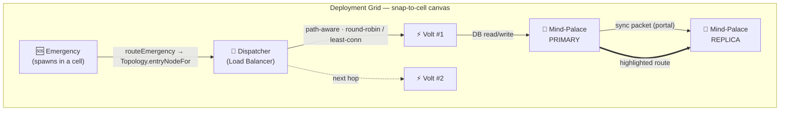
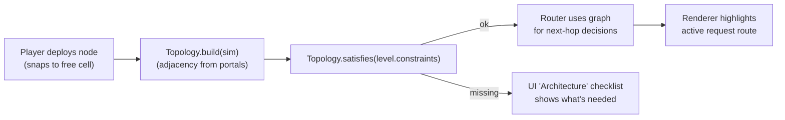

# Structured Topology & Deployment-Graph Design

**Date:** 2026-08-21
**Goal:** Replace the current free-form component-addition and request-routing with (1) an internal graph engine, (2) constraint-based level blueprints, (3) a snap-to-grid *deployment* model, and (4) route-highlight rendering — so the system forms a coherent, logical topology that adapts as components are added.
**Style note:** Placement is treated as a structured **deployment** onto a logical grid, visualized by a deployment diagram.

## Constraints (agreed)

- Keep **zero-dependency / zero-build**. New `js/topology.js` is plain `window.Topology`, loaded via `<script>` in `index.html`.
- The graph engine is a **read-only view** of `sim.portals`/`sim.nodes`; it never mutates game state.
- All existing packet mechanics (hop speed, loss, retry, ACK, partition) stay **identical** so the 6 levels remain winnable (verified by the headless test).
- Degrade gracefully: if `topology.js` is absent, `simulation.js` falls back to current heuristics.

## 1. Deployment Diagram (target topology)





## 2. `js/topology.js` — Graph Engine

Exposes `window.Topology` with:

- `build(sim)` — derive adjacency list from `sim.portals` (rebuild on portal add/remove).
- `neighbors(node)` — linked nodes.
- `path(from, to, { weighted })` — BFS by hop count (weighted optional via edge cost).
- `nodesByRole(type, filterFn)` — e.g. all active Volts, health-filtered.
- `reachable(start, predicate)` — flood fill used by DB replica/CP logic.
- `entryNodeFor(request)` — first hop: prefer a Dispatcher if present & reachable, else nearest capable Volt. Preserves current semantics.
- `bestTarget(fromNode, role, policy)` — selects target among `nodesByRole(role)` by `round-robin` / `least-connections` (mirrors `processDispatcherNode`).
- `satisfies(constraints, sim)` — returns `{ ok, missing: [] }`.

The module is pure and side-effect free; it only reads `sim`.

## 3. Routing Refactor (`simulation.js`) — mechanics unchanged

- `routeEmergency(emergency)` → delegates target selection to `Topology.entryNodeFor`. Same "dispatcher-first else nearest Volt" outcome.
- `processDispatcherNode(dispatcher)` → target Volts via `Topology.nodesByRole('volt', healthFilter)` + `Topology.bestTarget`. Same round-robin/least-connections + ACK/retry flow.
- `processDatabaseNode` / `getReachableDBNodes` → use `Topology.reachable` for replica discovery & CP-mode minority check.
- **Packets gain an additive `route`** (ordered node-id list) describing the full path; single-hop remains default (`route = null`). Used only for highlight; does not change transit math.
- All portal transit, loss, retry, ACK, and partition logic in `processPortals`/`deliverPacket` stay untouched.

## 4. Constraint-Based Level Blueprints

- A level may declare:
  ```js
  topology: {
    require: ['dispatcher', 'volt'],
    constraints: [
      (sim) => sim.nodes.some(n => n.type === 'dispatcher') || 'Need a Dispatcher',
      (sim) => sim.portals.some(p => /* dispatcher↔volt linked */) || 'Link Dispatcher to a Volt',
      (sim) => Topology.reachable(...).length >= 2 || 'All Volts must be reachable',
    ]
  }
  ```
- `Topology.satisfies(level.topology, sim)` → `{ ok, missing }`. Surface in UI as a live **Architecture** checklist/guide (additive; existing level objectives unchanged).
- Existing 6 levels keep their current objectives; blueprints are optional and additive.

## 5. Snap-to-Grid Deployment

- `simulation.snapToGrid(x, y)` → nearest cell center given canvas size and a fixed cell count; `simulation.isCellFree(gx, gy)` → rejects occupied/overlapping cells.
- `ui.js` deploy uses `snapToGrid` so placement is tidy and predictable (the "deployment" feel). Roles remain free to any cell.
- `renderer.js` / `FX` draws faint grid cells and highlights the hovered cell during deployment, making placement read as a logical structure.
- Optional: constraints may reference grid zones (e.g. "dispatcher in central row"), but base rule is tidy snapping.

## 6. Rendering — Deployment-Diagram Style (chosen)

The canvas should read as a proper **architecture deployment diagram**, not free glowing lines. This refines the earlier graphics-polish sprite work (replacing the simple hero emblems with diagram-shaped nodes + orthogonal connectors).

**Node shapes — hand-authored SVGs following standard cloud-diagram conventions** (no external pack; license-clean, zero-build, embedded as data-URIs in `fx.js`):

| Game component | Diagram convention | Shape |
|---|---|---|
| `volt` (compute / speedster) | Compute / server / pod | Rounded-rect with a small "CPU" notch or pod glyph |
| `dispatcher` (load balancer) | Load Balancer | Hexagon / diamond with directional arrows |
| `mind-palace` (storage / DB) | Database | Cylinder |
| `coordinator` (orchestrator) | Control / orchestration | Rounded-square with a gear / helm glyph |
| `cache` (if deployed) | Cache / queue | Stacked-layer or pipeline glyph |
| `emergency` (distress call) | Incident / alert | Pulsing diamond/triangle with SOS |

Each node is drawn as a **bordered card**: shape + role title bar + status port stubs, so different component types are visually distinct by shape (not just color/emoji).

**Connectors — orthogonal diagram edges:**
- `FX.orthogonalLink(from, to, opts)` draws right-angle "elbow" connectors between node **ports** (top/right/bottom/left attachment points), not center-to-center straight lines.
- A small **link-type label** rides the connector (`request`, `sync`, `write`, `read`, `ack`) so the flow is self-documenting.
- Partitioned links keep the red severed style; congested links tint amber.

**Deployment grid:**
- `renderer.js` / `FX` draws the visible snap **grid cells** as the diagram canvas; the hovered cell is highlighted during deployment.

**Route highlight (chosen earlier):**
- Each in-transit packet's `route` produces a `highlightedPortals` set; `FX.orthogonalLink` boosts glow on those edges so the player sees the request's path through the graph.

All of the above are additive presentation changes in `fx.js` + `renderer.js`; they read only existing sim fields and never mutate game state.

## 7. No-Break Guarantees

- `window.Topology` guarded everywhere in `simulation.js`; fallback to current heuristics if absent.
- `route` and grid helpers are additive fields/functions; no existing sim state is removed or restructured.
- Headless test must pass for **all 6 levels** after the refactor.

## 8. Verification

1. `node --check js/topology.js && node --check js/simulation.js`.
2. Headless sim test (AGENTS.md pattern) for all 6 levels — still winnable.
3. Topology unit smoke (`node -e`): build graph from a known sim, assert `path`, `reachable`, `nodesByRole`, and `satisfies` outcomes.
4. Manual: snap placement + route highlight on Levels 2–3; graceful fallback with `topology.js` removed.

## 9. Out of Scope (YAGNI)

- No new gameplay mechanics or level objective changes.
- No vendored library; pure Canvas 2D + plain JS.
- No change to the surrounding DOM/HUD panels beyond the additive Architecture checklist.
